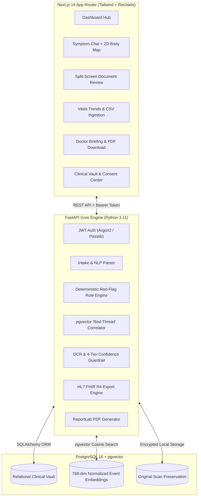

# MediKiosk (AyuVani / MediThread)

> **Privacy-First AI Clinical Intake & Longitudinal Health Organizer**  
> Converts patient-reported symptoms, wearables/vitals readings, and unstructured medical documents into a structured, doctor-reviewable longitudinal health record with strictly non-diagnostic safety guardrails.

[]()
[]()
[]()
[]()
[]()

---

## 🌟 Core Highlights & Architectural Pillars

- **Non-Diagnostic Pre-Consultation Organizing**: Operates as a clinical intelligence copilot. Strictly non-causal medical phrasing (*"A past record mentions X... This historical context may be relevant for your doctor to review"*), with explicit disclaimers on every view.
- **Document Pipeline & 4-Tier Confidence Scoring**: Preserves original scans (PDF/PNG/JPEG/TIFF), runs Tesseract OCR + LLM/heuristic field extraction, classifies fields into 4 confidence tiers, and enforces a **mandatory user review guard** before clinical confirmation.
- **pgvector "Red-Thread" Historical Correlation**: Generates 768-dimensional normalized event embeddings with cosine similarity matching to highlight connections between current symptoms and past visits, conditions, or medications.
- **Deterministic Emergency Red-Flag Engine**: Standalone rule-based detector completely decoupled from LLMs to immediately identify acute cardiac, neurological, or hypertensive emergencies.
- **Interactive 2D SVG Body Map**: Front & back anatomical silhouettes enabling patients to map pain regions, laterality (left/right/bilateral), pain character (sharp, dull, throbbing), and 1–10 severity ratings.
- **Longitudinal Timeline & ReportLab PDF Summary**: Chronologically grouped health narrative and 1-click printable pre-consultation doctor briefing PDF with physician signature blocks.
- **HL7 FHIR R4 & Data Sovereignty**: Full FHIR R4 Bundle export (`Patient`, `Condition`, `Observation`, `AllergyIntolerance`, `MedicationStatement`, `Encounter`, `DocumentReference`), granular consent switches, and tamper-evident audit logging.

---

## 🏗️ Architecture



---

## 🚀 Quickstart Guide

### Prerequisites
- **Docker & Docker Compose**
- **Node.js 18+** & **npm**
- **Python 3.11+** (for running backend locally)

---

### Option 1: Full Docker Compose Setup (Recommended)

1. **Clone the repository:**
   ```bash
   git clone https://github.com/Nagasiddhartha/MediKiosk.git
   cd MediKiosk
   ```

2. **Spin up the stack (Postgres + pgvector & FastAPI backend):**
   ```bash
   docker compose up --build
   ```
   * PostgreSQL + pgvector will listen on `127.0.0.1:5433` (or `5432`)
   * FastAPI backend will listen on `http://127.0.0.1:8000`
   * API Interactive Docs: `http://127.0.0.1:8000/docs`

3. **Start the Next.js Frontend:**
   ```bash
   cd frontend
   npm install
   npm run dev
   ```
   * Open `http://localhost:3000` in your browser.

---

### Option 2: Local Development Setup

#### 1. Database (Docker pgvector container)
```bash
docker run -d --name medikiosk-db \
  -e POSTGRES_USER=medikiosk \
  -e POSTGRES_PASSWORD=medikiosk \
  -e POSTGRES_DB=medikiosk \
  -p 5433:5432 \
  pgvector/pgvector:pg16
```

#### 2. Backend (FastAPI)
```bash
cd backend
python -m venv .venv
# On Windows: .venv\Scripts\activate
# On Linux/macOS: source .venv/bin/activate

pip install -r requirements.txt
alembic upgrade head

# Seed preloaded demo patient (Eleanor Vance)
python scripts/seed_demo_data.py

# Start FastAPI server
uvicorn app.main:app --reload --port 8000
```

#### 3. Frontend (Next.js 14)
```bash
cd frontend
npm install
npm run dev
```

---

## 👤 Preloaded Demo Credentials

For quick evaluation and testing, MediKiosk includes a seeded demo patient with longitudinal history:

- **Email:** `eleanor@example.com`
- **Password:** `password123`
- **1-Click Quick Login:** Available directly on the login screen (`/login`) via the **"Sign In with Demo Patient"** button.
- **Preloaded Records:**
  - Active Conditions: Type 2 Diabetes, Essential Hypertension
  - Medications: Metformin 500mg, Amlodipine 5mg, Atorvastatin 20mg
  - Allergies: Penicillin (Severe/Anaphylaxis), Sulfa Drugs (Moderate)
  - 30-Day Vitals: Blood pressure & blood glucose logs
  - Verified Documents: Clinical prescriptions with OCR field extraction
  - Body Map Encounter: Right retro-orbital throbbing headache

---

## 🧪 Testing & Verification

### Run Backend Unit & Integration Tests:
```bash
cd backend
python -m pytest tests -v
```
*Executes all 11 test suites covering confidence scoring, CSV parsing, red-flag emergency detection, FHIR export, and embedding determinism.*

### Run Complete 39-Feature End-to-End Suite:
```bash
python scratch/test_deep_check.py
```
*Validates 100% (39/39) of all API contracts, authentication flows, body map serialization, document confirmation locks, trends, and privacy audit trails.*

### Verify Frontend Production Build:
```bash
cd frontend
npm run build
```
*Compiles all 14 static and dynamic routes with zero TypeScript or JSX errors.*

---

## 🔒 Security & Privacy Commitments

- **User-Scoped Isolation**: Every query and document access is strictly scoped to the authenticated user's ID via JWT claims.
- **Path Traversal Protection**: Storage service prevents arbitrary file access outside the designated storage root.
- **Mandatory Confirmation Guard**: Extracted OCR fields cannot be committed to longitudinal records without explicit user review (`Accept`, `Correct`, or `Reject`).
- **Cryptographic Audit Trail**: Every sensitive operation (upload, edit, deletion, export) logs an immutable audit event.
- **Right to Erasure**: Users can permanently purge all demographic data, health records, files, and vector embeddings in one click.

---

## 📄 License
This project is licensed under the MIT License - see the [LICENSE](LICENSE) file for details.
